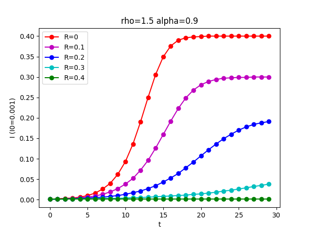

# Assignment 5 - FCB 2020
### Deadline: 06/11/2020 - 23:59

## Submission procedure

This assignment has to be submitted using GitHub Classroom. This
means that you should have cloned the GitHub repo of this assignment from
the organization account for FCB in the academic year 2020-21 at
[https://github.com/funcompbio2020](https://github.com/funcompbio2020)
using the submission link provided at the FCB Moodle site.

Once you have cloned the GitHub repo which has `assignment-5` and your
GitHub username as repo name, then you can work on it in your local disk
and _push_ your changes whenever you like, but make sure that you have pushed
the last version of your assignment before the deadline. There is no
_submit_ button or any other specific submission procedure or action than
just pushing your changes to you GitHub assignment repo. When correcting the
assignment, the version available at the deadline will be retrieved. If the
first version available is posterior to the deadline, then the mark of the
assignment will have a penalty.

## Description

The goal of this assignment is to **implement in Python a simplified SIR
model of spreading infectious diseases.**

This assignment incorporates [GitHub Classroom Autograding](https://mspoweruser.com/github-classroom-autograding-feature),
which will help you to automatically test whether your Python program is
correctly working after every _push_. To work with this feature you
need to edit your program in the existing files `src/sir.py` and
`src/sirv.py`, and leave the rest of the files and directory structure
intact. The files `src/sir.py` and `src/sirv.py` are templates that
contain instructions written as comments, indicating where should you
edit your code.

In the first script `src/sir.py` you should implement the simplified
SIR model corresponding to the differential equation:


This model requires the specification of two constant parameters,
`rho` and `alpha`, which the provided template script takes as
arguments in the command line. For instance, if we want to simulate
this model using `rho=1.5` and `alpha=0.9`, we should call it as follows:

```
$ python sir.py 1.5 0.9
```

In the second script `src/sirv.py` you should implement the simplified
SIR model that incorporates the fraction of the population `R` that has
been vaccinated, corresponding to the differential equation:


Next to the previous constant parameters `rho` and `alpha`, this model
requires the specification of a third one `R`, corresponding to the
fraction of the population that has been vaccinated. For instance, if
we want to simulate this model using `rho=1.5`, `alpha=0.9` and
`R=0.1`, we should call it as follows:

```
$ python sirv.py 1.5 0.9 0.1
```

If you run this simulation with R values `R={0, 0.1, 0.2, 0.3 ,0.4}`,
and plot the curves together, you should getting the graph shown below
(see the _matplotlib_ documentation for how to add
[axis labels](https://matplotlib.org/3.1.0/gallery/pyplots/fig_axes_labels_simple.html) and [legends](https://matplotlib.org/tutorials/intermediate/legend_guide.html)).



Seeing this plot, think about why the curves change with the fraction
of vaccinated population `R` and why is it not necessary to vaccinate
the entire population to end with the simulated infectious disease.

Your assignment repo should have the following files:

  1. This `README.md` file.
  2. The `sirv.png` image file with the plot shown above.
  2. The `src` directory with the initial files of the assignment repo.
  3. The `test` directory with the initial files of the assignment repo.

Eventually, you may encounter that Python automatically creates a directory called
`__pycache__`, you may ignore that directory since this template is already
prepared to ignore that directory by including it into a `.gitignore` file that
informs Git to avoid putting certain files under version control. In any case,
**you should only be editing the files `src/sir.py` and `src/sirv.py`**.

## Evaluation rubric

The rubric to evaluate this assignment consists of the following items:

  * Does the assignment contain the required files?
  * Does the Python program `src/sir.py` runs without errors?
  * Does the Python program `src/sir.py` runs the simulation of the corresponding model correctly?
  * Does the Python program `src/sir.py` passes all autograding tests?
  * Does the Python program `src/sirv.py` runs without errors?
  * Does the Python program `src/sirv.py` runs the simulation of the corresponding model correctly?
  * Does the Python program `src/sirv.py` passes all autograding tests?
